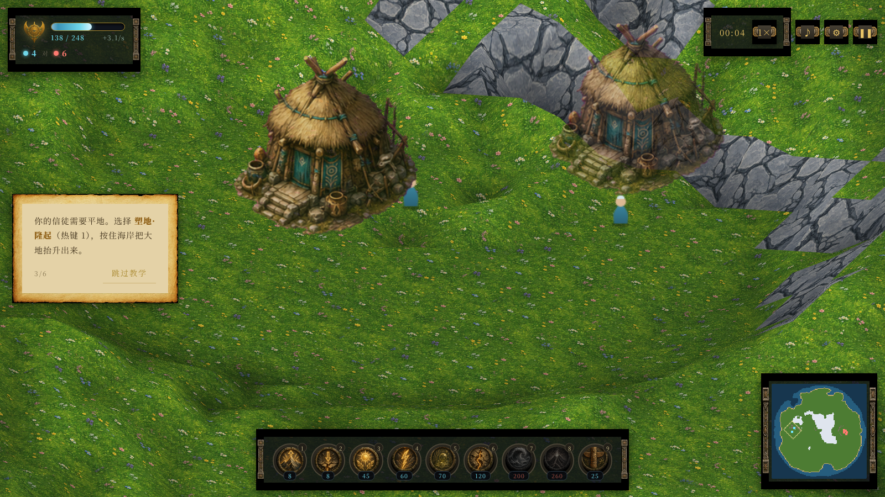

# 创世之怒 · GENESIS FURY

> Populous 血统的网页上帝游戏。扮演苍蓝之神，塑造大地、降下神迹，引导信徒消灭绯红邪神。
> PixiJS v8 · TypeScript · 全素材 AI 生成 · 全音频程序化合成 · 零运行时依赖安装。
>
> **🎮 在线试玩：https://claudetee.github.io/genesis-fury/**




---

## 一键运行

任何静态服务器即可（无后端、无构建时依赖下载）：

```bash
cd genesis-fury
python3 -m http.server 8931
# 打开 http://127.0.0.1:8931
```

仓库自带构建产物 `dist/bundle.js`，开箱即玩。重新构建见下文。

## 操作

| 输入 | 动作 |
|------|------|
| 左键点击 | 施放选中的神迹（塑地可按住连发） |
| 左键拖 / 右键拖 / 中键拖 | 平移镜头（带惯性） |
| 滚轮 / 双指捏合 | 指向缩放 |
| WASD / 方向键 / 屏幕边缘 | 平移镜头 |
| `1`–`0` / `T` | 神迹热键（陨星风暴 7 / 神行 0 / 图腾 T）|
| `Z` `X` `C` `V` | 营造：武堂 / 火祭坛 / 圣所 / 守卫塔 |
| 点击大地（无选中时）| 移动**神使** |
| `Esc` | 取消选中 → 暂停 |
| `F3` | 性能调试面板（fps / JS 帧耗时 / 实体数 / heap） |
| 触屏 | 单指拖动平移、点按施法、双指捏合缩放 |

## 玩法

信徒自主寻找**平地**定居建屋 → 房屋繁衍人口 → 人口产出**信仰** → 信仰施放**神迹**。
你唯一能直接指挥的是**神使化身**（Populous 正统）：点地移动她，神迹只能降在她 20 格
祈告半径内；她被围杀则神迹失声、25 秒后圣殿转生。信徒不可直接命令——用塑地开辟家园、
图腾引导迁徙；**营造**训练屋把信徒转为战士/火法师/传教士，守卫塔自动御敌；
地图散布中立**野人**，圣光祝福可感化入教，传教士能在战场直接策反敌方信徒。
**歼灭敌方全部人口获胜**；20 分钟后进入终焉审判（神力三倍、毁灭神迹半价）。
9 种神迹、数值与冷却详见 [docs/DESIGN.md](docs/DESIGN.md)；敌方 AI 与你使用完全相同的
神迹与费用，无资源作弊，难度只改变它的决策频率与失误率。

## 架构

```
index.html + styles.css      DOM 外壳：石雕/羊皮卷主题 HUD、屏幕流转（CSS border-image 九宫格）
vendor/pixi.min.js           PixiJS v8.6.6（vendored，无 CDN 运行时依赖）
src/
  core/    const(全部数值表) events(类型化总线) rng(种子噪声) save(localStorage)
  sim/     world(129² 角点高度场+形变) sim(10Hz 固定步长) entities miracles ai
  render/  terrainMesh(chunk Mesh+自定义shader) entities fx(粒子池) camera minimap renderer
  input/   鼠标/键盘/触屏统一手势层
  audio/   WebAudio 全程序化：风/海/鸟环境音景 + 生成式竖琴/圣咏/战鼓 + 全套合成 SFX
  ui/      hud screens tutorial
  main.ts  状态机 + 主循环（模拟 10Hz 与渲染 60fps 解耦，位置插值）
assets/    AI 生成素材（manifest.json 索引，缺失自动程序化兜底，永不破图）
```

**渲染要点**：地形是 8×8 个 chunk（每 chunk 16×16 瓦片）的 WebGL Mesh —— 角点高度位移、
逐顶点光照（坡向阳面/阴面）、单张图集 + 自定义 GLSL（水面 UV 扰动与顶点波浪、岩浆自发光脉动
内建于 shader，零额外 draw call）。神迹形变走"显示高度向模拟高度缓动"，大地是**隆起来**的，
不是瞬移的。

**性能设计**：chunk 按需重建（只在形变动画期间）、粒子池 640 预分配零运行时 new、实体视图
diff 同步 + 池化、chunk 视口裁剪、小地图 ImageData 直写 + 3Hz 节流、瓦片画家序预计算。

## 构建（可选）

本地不装任何包——借用 monorepo 既有工具链：

```bash
./build.sh           # esbuild 打包 → dist/bundle.js（~90KB, minified+sourcemap）
./build.sh --check   # typescript 严格类型检查（strict, 零 any 逃逸出渲染边界层）
```

> esbuild 来自 `main_backend/node_modules`，typescript 来自 `DZMM-WEB-MAIN/node_modules`。
> 换环境时改 `build.sh` / `tools/typecheck.mjs` 顶部路径，或 `npm i -D esbuild typescript`。

## 素材管线（复现）

全部美术由 OpenRouter `openai/gpt-5.4-image-2` 生成（fallback: gpt-5-image → gemini-3-pro-image），
sharp 后处理：网格切片（图标 3×3 / 地形 3×2 / 建筑 3×3）、品红 chroma-key 抠图 + 去边、
黑底 luma-key、trim、无缝化镜像混边。每张图的 prompt、模型、后处理步骤记录在
[docs/ASSETS.md](docs/ASSETS.md)。

```bash
python3 /workspace/tools/secrets-manager/secrets-manager.py exec -k OPENROUTER_API_KEY -t 1800 \
  'node tools/gen_assets.mjs'          # 增量（raw 缓存跳过）；--force 全部重生成；--only <name> 单张
```

API key 只经环境变量注入，不落盘、不进代码。生成失败时游戏自动使用程序化兜底美术
（canvas 绘制的图标/建筑/纹理），保证任何情况下无破图、无裸样式。

## 自测与性能数据

自动化 e2e（Playwright，`tools/e2e_test.mjs`）跑通完整链路：
标题 → 难度 → 开局运镜 → 塑地/祝福/雷罚施放 → 拖拽缩放 → 3× 速对局 → 小地图跳转 →
暂停/设置 → 存档退出 → **读档续玩（游戏时间与人口正确恢复）**，全程零 JS 错误。
截图存 `docs/screenshots/`。模拟层另有无头冒烟测试 `tools/sim_test.ts`（12 分钟完整对局）。

| 指标 | 数值 | 环境 |
|------|------|------|
| JS 主循环 | **avg 6.75ms / peak 35.7ms**（中期 ~100 实体，3× 速） | 容器 CPU |
| 模拟层 | 0.45ms/tick @ 500+ 实体（预算 100ms/tick 的 0.5%） | node 无头 |
| 包体 | bundle 92KB + pixi 650KB + 素材 ~11MB（webp/png） | — |
| 顶点/draw call | ≤65k 顶点，~30 draw calls（64 chunk 裁剪后更少） | — |

> **60fps 说明**：本容器无 GPU（SwiftShader 软渲染，填充率瓶颈，实测 fps 随像素数反比缩放，
> 与 JS 无关）。JS 帧耗时 6.75ms « 16.6ms 预算，WebGL 负载对任何真实 GPU（含核显）都是
> 轻量级——真机预期稳定 60fps。F3 面板可实时验证。

## 已知限制

- 单位遮挡为画家排序近似（单位始终画在地形上层），极端高差下山体不会遮挡背后单位
- 信徒寻路是转向启发式而非 A*，会被复杂峡谷地形短暂卡住（有随机脱困）
- 存档完整保存地形（含沼泽/岩浆倒计时）、实体（含祝福/着火状态）、信仰与神迹冷却；仅 AI 决策计时器与粒子特效不入档
- 洪水为全图水位 +1 的抽象模型，不做流体扩散
- iOS Safari 首次点击后才有声音（浏览器自动播放策略，已做手势解锁）

## 目录

- [docs/DESIGN.md](docs/DESIGN.md) — 设计文档：核心循环 / 胜负 / 神迹数值表 / AI 状态机
- [docs/ASSETS.md](docs/ASSETS.md) — 素材生成记录：每张图的 prompt / 模型 / 后处理
- [docs/screenshots/](docs/screenshots/) — 一局完整流程验证截图
